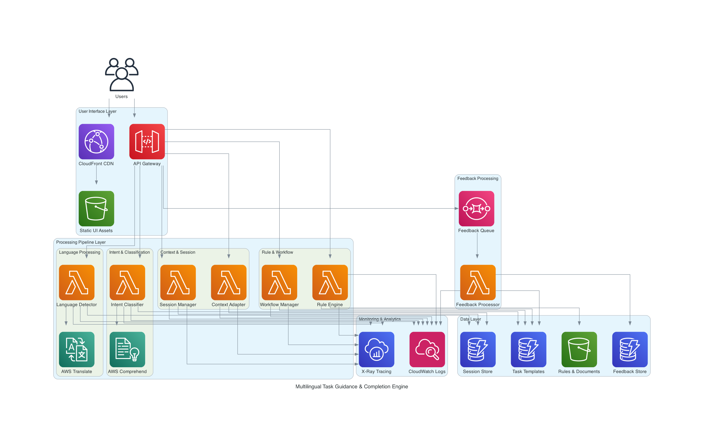

# Design Document: Multilingual Task Guidance & Completion Engine

## Overview

The Multilingual Task Guidance & Completion Engine is a sophisticated system that provides personalized, step-by-step guidance to users completing complex tasks in their native language. The system employs a modular architecture with six core components working together to deliver an adaptive, context-aware guidance experience.

The design follows a pipeline architecture where user input flows through language detection, intent classification, rule interpretation, workflow management, and context adaptation before generating personalized guidance. Each component is designed to be independently testable and replaceable, enabling continuous improvement through feedback processing.

Key design principles:
- **Language-first**: All user-facing content is generated in the user's detected language
- **Context-aware**: Guidance adapts based on user location, situation, and inputs
- **Progressive disclosure**: Information is presented step-by-step to avoid overwhelming users
- **Fail-safe**: Graceful error handling with session persistence
- **Feedback-driven**: Continuous improvement through user feedback analysis

## Architecture

The system follows a layered architecture with clear separation of concerns:

```
┌─────────────────────────────────────────────────────────────┐
│                     User Interface Layer                     │
│              (Receives input, displays guidance)             │
└─────────────────────────────────────────────────────────────┘
                              │
                              ▼
┌─────────────────────────────────────────────────────────────┐
│                   Processing Pipeline Layer                  │
│  ┌──────────────┐  ┌──────────────┐  ┌──────────────┐      │
│  │   Language   │→ │    Intent    │→ │     Rule     │      │
│  │   Detector   │  │  Classifier  │  │    Engine    │      │
│  └──────────────┘  └──────────────┘  └──────────────┘      │
│                              │                               │
│                              ▼                               │
│  ┌──────────────┐  ┌──────────────┐  ┌──────────────┐      │
│  │   Context    │← │   Workflow   │← │   Session    │      │
│  │   Adapter    │  │   Manager    │  │   Manager    │      │
│  └──────────────┘  └──────────────┘  └──────────────┘      │
└─────────────────────────────────────────────────────────────┘
                              │
                              ▼
┌─────────────────────────────────────────────────────────────┐
│                      Data Layer                              │
│  ┌──────────────┐  ┌──────────────┐  ┌──────────────┐      │
│  │    Task      │  │   Session    │  │   Feedback   │      │
│  │  Templates   │  │    Store     │  │    Store     │      │
│  └──────────────┘  └──────────────┘  └──────────────┘      │
└─────────────────────────────────────────────────────────────┘
                              │
                              ▼
┌─────────────────────────────────────────────────────────────┐
│                   Feedback Processing Layer                  │
│              (Analyzes feedback, updates templates)          │
└─────────────────────────────────────────────────────────────┘
```

### AWS Architecture Diagram

The following diagram illustrates a serverless AWS implementation of the system architecture:



**Key AWS Services:**
- **CloudFront + S3**: Content delivery and static UI hosting
- **API Gateway**: RESTful API entry point
- **Lambda Functions**: Serverless compute for all processing components
- **DynamoDB**: NoSQL database for sessions, tasks, and feedback
- **S3**: Object storage for rules and documents
- **AWS Translate**: Multilingual translation service
- **AWS Comprehend**: Natural language processing and intent classification
- **SQS**: Asynchronous feedback processing queue
- **CloudWatch + X-Ray**: Monitoring, logging, and distributed tracing

### Component Interactions

1. **User Input Flow**: User input → Language Detector → Intent Classifier → Rule Engine → Workflow Manager → Context Adapter → Response Generation
2. **Session Flow**: Session Manager maintains state throughout the interaction, persisting progress and context
3. **Feedback Flow**: User feedback → Feedback Processor → Template updates → Improved guidance

## Components and Interfaces

### 1. Language Detector

**Purpose**: Identifies the language of user input and maintains language context throughout the session.

**Interface**:
```
detectLanguage(text: String) -> LanguageCode
  Input: User text in any supported language
  Output: ISO 639-1 language code (e.g., "en", "es", "zh")
  Confidence: Float (0.0 to 1.0)

getSupportedLanguages() -> List<LanguageInfo>
  Output: List of supported languages with codes and names

setSessionLanguage(sessionId: String, languageCode: LanguageCode) -> Boolean
  Input: Session identifier and language code
  Output: Success/failure indicator
```

**Implementation Approach**:
- Use statistical language detection library (e.g., langdetect, fastText)
- Maintain language preference per session
- Support language override by user
- Cache detection results to avoid redundant processing

**Key Behaviors**:
- Detect language from first user message
- Apply detected language to all subsequent responses
- Handle language switches mid-session
- Default to English if confidence < 0.95

### 2. Intent Classifier

**Purpose**: Determines what task the user wants to complete based on their natural language description.

**Interface**:
```
classifyIntent(text: String, languageCode: LanguageCode) -> IntentResult
  Input: User description and language code
  Output: TaskType, confidence score, alternative suggestions

getTaskTypes() -> List<TaskType>
  Output: All supported task types with descriptions

confirmIntent(sessionId: String, taskType: TaskType) -> Boolean
  Input: Session ID and confirmed task type
  Output: Success indicator
```

**Implementation Approach**:
- Use machine learning classifier trained on task descriptions
- Support multilingual classification (translate to English internally if needed)
- Provide top-N predictions when confidence is moderate
- Ask clarifying questions when confidence < 0.90

**Key Behaviors**:
- Extract key phrases and entities from user input
- Match against task template database
- Present disambiguation options when multiple tasks match
- Confirm understanding before proceeding

### 3. Rule Engine

**Purpose**: Retrieves, interprets, and explains rules, eligibility requirements, and constraints for a given task.

**Interface**:
```
getRules(taskType: TaskType, userContext: UserContext) -> RuleSet
  Input: Task type and user context
  Output: Applicable rules, requirements, and constraints

evaluateEligibility(ruleSet: RuleSet, userContext: UserContext) -> EligibilityResult
  Input: Rules and user context
  Output: Pass/fail for each requirement with explanations

explainRule(rule: Rule, languageCode: LanguageCode) -> String
  Input: Rule object and target language
  Output: Human-readable explanation in specified language
```

**Implementation Approach**:
- Store rules in structured format with metadata
- Support rule versioning and effective dates
- Implement rule evaluation engine with conditional logic
- Generate explanations using templates with variable substitution

**Key Behaviors**:
- Filter rules based on user context (location, situation)
- Evaluate eligibility criteria against user inputs
- Explain rules in simple, non-technical language
- Highlight conflicts or exceptions
- Provide rule sources and references

### 4. Workflow Manager

**Purpose**: Sequences steps, manages workflow progression, and handles conditional branching.

**Interface**:
```
initializeWorkflow(taskType: TaskType, userContext: UserContext) -> Workflow
  Input: Task type and user context
  Output: Initialized workflow with ordered steps

getNextStep(workflow: Workflow) -> Step
  Input: Current workflow state
  Output: Next step to present to user

completeStep(workflow: Workflow, stepId: String, userInput: Any) -> Workflow
  Input: Workflow, completed step ID, and user input
  Output: Updated workflow state

getProgress(workflow: Workflow) -> ProgressInfo
  Input: Current workflow
  Output: Completed steps, remaining steps, estimated time
```

**Implementation Approach**:
- Load task template with step definitions
- Build directed acyclic graph (DAG) of steps with dependencies
- Evaluate conditions to determine next step
- Track completion status for each step

**Key Behaviors**:
- Present steps in correct sequential order
- Verify prerequisites before showing step
- Handle conditional branches based on user inputs
- Allow navigation to previous steps
- Calculate and display progress indicators

### 5. Context Adapter

**Purpose**: Personalizes guidance based on user location, situation, and inputs.

**Interface**:
```
buildContext(sessionId: String, userInputs: Map<String, Any>) -> UserContext
  Input: Session ID and user-provided information
  Output: Structured user context object

adaptStep(step: Step, userContext: UserContext) -> AdaptedStep
  Input: Generic step and user context
  Output: Personalized step with context-specific instructions

recommendPath(workflow: Workflow, userContext: UserContext) -> List<Step>
  Input: Workflow and user context
  Output: Recommended path through workflow
```

**Implementation Approach**:
- Extract location from user input or IP geolocation
- Maintain context state throughout session
- Apply context filters to step instructions
- Use template variables for personalization

**Key Behaviors**:
- Customize instructions based on jurisdiction
- Filter irrelevant options based on user situation
- Update context as user provides new information
- Recommend optimal path based on context
- Warn about eligibility issues proactively

### 6. Session Manager

**Purpose**: Manages session lifecycle, persistence, and state recovery.

**Interface**:
```
createSession(userId: String) -> SessionId
  Input: User identifier (optional)
  Output: Unique session identifier

saveSession(sessionId: String, sessionState: SessionState) -> Boolean
  Input: Session ID and complete state
  Output: Success indicator

loadSession(sessionId: String) -> SessionState
  Input: Session identifier
  Output: Restored session state

listSessions(userId: String) -> List<SessionSummary>
  Input: User identifier
  Output: All active sessions for user

expireSessions(olderThan: Duration) -> Int
  Input: Age threshold
  Output: Number of sessions expired
```

**Implementation Approach**:
- Generate unique session IDs (UUID)
- Serialize session state to persistent storage
- Implement session expiration (30 days)
- Support session listing and resumption

**Key Behaviors**:
- Create session on first user interaction
- Save state after each step completion
- Restore complete state on session resume
- Clean up expired sessions periodically
- Handle concurrent session access

### 7. Feedback Processor

**Purpose**: Collects, analyzes, and processes user feedback to improve guidance quality.

**Interface**:
```
collectFeedback(sessionId: String, feedback: Feedback) -> Boolean
  Input: Session ID and feedback data
  Output: Success indicator

analyzeFeedback(taskType: TaskType, timeRange: DateRange) -> FeedbackAnalysis
  Input: Task type and time period
  Output: Aggregated feedback metrics and insights

flagIssue(sessionId: String, stepId: String, issueType: IssueType) -> Boolean
  Input: Session, step, and issue classification
  Output: Success indicator

getPriorityImprovements() -> List<ImprovementSuggestion>
  Output: Ranked list of suggested template improvements
```

**Implementation Approach**:
- Store feedback with rich metadata (task, language, step, context)
- Aggregate feedback by task type and step
- Identify patterns in negative feedback
- Generate improvement suggestions

**Key Behaviors**:
- Prompt for feedback at session completion
- Accept ratings, comments, and issue reports
- Link feedback to specific steps and templates
- Identify high-priority improvement areas
- Track feedback trends over time

## Data Models

### LanguageCode
```
LanguageCode: String (ISO 639-1 code)
  Examples: "en", "es", "fr", "de", "zh", "ja", "ar", "hi", "pt", "ru"
```

### LanguageInfo
```
LanguageInfo:
  code: LanguageCode
  name: String (language name in English)
  nativeName: String (language name in native script)
  supported: Boolean
```

### IntentResult
```
IntentResult:
  taskType: TaskType
  confidence: Float (0.0 to 1.0)
  alternatives: List<TaskType> (up to 3 alternatives)
  needsClarification: Boolean
```

### TaskType
```
TaskType:
  id: String (unique identifier)
  name: String (task name)
  description: String (brief description)
  category: String (domain category)
  templateVersion: String
```

### UserContext
```
UserContext:
  location: Location (country, region, city)
  inputs: Map<String, Any> (user-provided information)
  eligibilityStatus: Map<String, Boolean> (requirement evaluations)
  preferences: Map<String, Any> (user preferences)
  sessionStartTime: Timestamp
```

### Location
```
Location:
  country: String (ISO 3166-1 alpha-2 code)
  region: String (state/province)
  city: String (optional)
  jurisdiction: String (legal jurisdiction identifier)
```

### Rule
```
Rule:
  id: String
  type: RuleType (ELIGIBILITY | CONSTRAINT | REQUIREMENT | DEADLINE)
  condition: String (logical expression)
  description: Map<LanguageCode, String> (multilingual descriptions)
  source: String (reference or citation)
  effectiveDate: Date
  expirationDate: Date (optional)
```

### RuleSet
```
RuleSet:
  taskType: TaskType
  rules: List<Rule>
  eligibilityRequirements: List<Rule>
  constraints: List<Rule>
  deadlines: List<Rule>
```

### EligibilityResult
```
EligibilityResult:
  overallEligible: Boolean
  requirementResults: Map<String, RequirementResult>
  warnings: List<String>
  recommendations: List<String>
```

### RequirementResult
```
RequirementResult:
  requirementId: String
  passed: Boolean
  explanation: String
  missingInformation: List<String>
```

### Step
```
Step:
  id: String
  sequenceNumber: Int
  title: Map<LanguageCode, String>
  instructions: Map<LanguageCode, String>
  inputRequired: Boolean
  inputType: InputType (TEXT | NUMBER | DATE | CHOICE | FILE)
  inputOptions: List<String> (for CHOICE type)
  prerequisites: List<String> (step IDs)
  conditionalLogic: String (expression determining if step applies)
  estimatedTime: Duration
  helpText: Map<LanguageCode, String>
```

### Workflow
```
Workflow:
  id: String
  taskType: TaskType
  steps: List<Step>
  currentStepId: String
  completedSteps: Map<String, StepCompletion>
  userContext: UserContext
  createdAt: Timestamp
  lastUpdated: Timestamp
```

### StepCompletion
```
StepCompletion:
  stepId: String
  completedAt: Timestamp
  userInput: Any
  skipped: Boolean
```

### AdaptedStep
```
AdaptedStep:
  baseStep: Step
  personalizedInstructions: String
  relevantDocuments: List<DocumentRequirement>
  contextualWarnings: List<String>
  estimatedTimeForUser: Duration
```

### DocumentRequirement
```
DocumentRequirement:
  name: String
  description: String
  required: Boolean
  acceptableFormats: List<String>
  validityPeriod: Duration (optional)
  obtainmentInstructions: String
```

### ProgressInfo
```
ProgressInfo:
  totalSteps: Int
  completedSteps: Int
  currentStep: Int
  percentComplete: Float
  estimatedTimeRemaining: Duration
  stepHistory: List<String> (step IDs)
```

### SessionState
```
SessionState:
  sessionId: String
  userId: String (optional)
  languageCode: LanguageCode
  taskType: TaskType
  workflow: Workflow
  userContext: UserContext
  createdAt: Timestamp
  lastAccessedAt: Timestamp
  expiresAt: Timestamp
```

### SessionSummary
```
SessionSummary:
  sessionId: String
  taskType: TaskType
  languageCode: LanguageCode
  progress: ProgressInfo
  lastAccessedAt: Timestamp
```

### Feedback
```
Feedback:
  sessionId: String
  taskType: TaskType
  languageCode: LanguageCode
  rating: Int (1 to 5)
  comment: String (optional)
  specificIssues: List<IssueReport>
  submittedAt: Timestamp
```

### IssueReport
```
IssueReport:
  stepId: String
  issueType: IssueType (UNCLEAR | INCORRECT | MISSING_INFO | TECHNICAL_ERROR)
  description: String
  severity: Severity (LOW | MEDIUM | HIGH)
```

### FeedbackAnalysis
```
FeedbackAnalysis:
  taskType: TaskType
  timeRange: DateRange
  totalFeedback: Int
  averageRating: Float
  issuesByType: Map<IssueType, Int>
  issuesByStep: Map<String, Int>
  commonComplaints: List<String>
  improvementPriority: List<String> (step IDs)
```

### ImprovementSuggestion
```
ImprovementSuggestion:
  taskType: TaskType
  stepId: String
  issueCount: Int
  suggestedAction: String
  priority: Int (1 = highest)
```

## Correctness Properties

*A property is a characteristic or behavior that should hold true across all valid executions of a system—essentially, a formal statement about what the system should do. Properties serve as the bridge between human-readable specifications and machine-verifiable correctness guarantees.*


### Property 1: Language Detection Accuracy
*For any* user input in a supported language, the Language_Detector should identify the correct language with at least 95% confidence.
**Validates: Requirements 1.1**

### Property 2: Language Consistency Throughout Session
*For any* guidance session, once a language is detected or changed, all subsequent system responses should be generated in that language until another language change occurs.
**Validates: Requirements 1.2, 1.3**

### Property 3: Technical Term Translation Format
*For any* technical or legal term that requires translation, the system output should include both the translated term and the original term in parentheses.
**Validates: Requirements 1.5**

### Property 4: Intent Classification Accuracy
*For any* task description in a supported language, the Intent_Classifier should identify the correct task type with at least 90% confidence or request clarification.
**Validates: Requirements 2.1**

### Property 5: Classification Confirmation
*For any* task classification result, the system should confirm the identified task type with the user before proceeding to workflow initialization.
**Validates: Requirements 2.3**

### Property 6: Disambiguation Presentation
*For any* user input that matches multiple task types with similar confidence, the system should present exactly the top 3 most likely options for user selection.
**Validates: Requirements 2.5**

### Property 7: Complete Rule Retrieval
*For any* task type, the Rule_Engine should retrieve all associated rules, eligibility requirements, and constraints, and each rule should include a source reference.
**Validates: Requirements 3.1, 3.6**

### Property 8: Eligibility Evaluation Completeness
*For any* task with eligibility requirements and any user context, the system should evaluate the user's context against each requirement and provide a pass/fail result for each.
**Validates: Requirements 3.3**

### Property 9: Sequential Step Presentation
*For any* workflow, steps should be presented in the order defined by the task template, respecting all prerequisite dependencies.
**Validates: Requirements 4.1, 4.3**

### Property 10: Step Completion State Transition
*For any* step in a workflow, when marked as complete, the system should update the workflow state to mark that step complete and automatically present the next eligible step.
**Validates: Requirements 4.2**

### Property 11: Step History Completeness
*For any* workflow with completed steps, requesting step history should return all steps that have been marked complete in chronological order.
**Validates: Requirements 4.4**

### Property 12: Conditional Branch Selection
*For any* workflow with conditional branches and any user context, the Workflow_Manager should select the branch whose conditions are satisfied by the user's context and inputs.
**Validates: Requirements 4.6**

### Property 13: Progress Calculation Accuracy
*For any* workflow state, the progress indicators should accurately reflect the number of completed steps, total steps, and percentage complete.
**Validates: Requirements 4.7**

### Property 14: Context-Based Instruction Personalization
*For any* step and any two different user contexts, if the contexts differ in location or situation, the adapted step instructions should differ accordingly.
**Validates: Requirements 5.1, 5.2**

### Property 15: Workflow Context Adaptation
*For any* workflow, when user-provided information changes the context in a way that affects subsequent steps, the workflow should update to reflect the new context.
**Validates: Requirements 5.3**

### Property 16: Context Recommendation
*For any* task with multiple completion paths and any user context, the system should recommend a specific path based on the context.
**Validates: Requirements 5.4**

### Property 17: Proactive Ineligibility Warning
*For any* user context that fails one or more eligibility requirements, the system should inform the user of the ineligibility before they proceed through the workflow.
**Validates: Requirements 5.5**

### Property 18: Context Persistence
*For any* guidance session, user context established at any point should be consistently applied to all subsequent steps and guidance until the session ends or context is explicitly updated.
**Validates: Requirements 5.6**

### Property 19: Document Checklist Completeness
*For any* task that requires documents, the system should provide a checklist containing all required documents defined in the task template.
**Validates: Requirements 6.1**

### Property 20: Document Description Completeness
*For any* document in a checklist, the system should provide a description explaining what the document is, why it's needed, and where to obtain it.
**Validates: Requirements 6.2**

### Property 21: Context-Based Document Filtering
*For any* task with context-dependent document requirements and any user context, the system should show only documents whose conditions are satisfied by the user's context.
**Validates: Requirements 6.3**

### Property 22: Document Classification Accuracy
*For any* document in a checklist, the system should correctly indicate whether the document is required or optional based on the task template and user context.
**Validates: Requirements 6.4**

### Property 23: Document Metadata Completeness
*For any* document in a checklist, the system should specify acceptable formats, validity periods (if applicable), and any special requirements.
**Validates: Requirements 6.5**

### Property 24: Feedback Prompt on Completion
*For any* guidance session that reaches completion, the system should prompt the user to provide feedback.
**Validates: Requirements 7.1**

### Property 25: Feedback Storage with Metadata
*For any* user feedback submitted, the system should store the feedback along with task type, language code, session context, and timestamp metadata.
**Validates: Requirements 7.2**

### Property 26: Issue Flagging from Negative Feedback
*For any* feedback indicating an error or confusion about a specific step, the system should flag that step for review.
**Validates: Requirements 7.3**

### Property 27: Issue Prioritization
*For any* task template, if multiple users report similar issues within a time period, the system should assign that template a higher improvement priority than templates with fewer issues.
**Validates: Requirements 7.5**

### Property 28: Low-Confidence Language Fallback
*For any* user input where language detection confidence is below 95%, the system should default to English and explicitly ask the user to specify their preferred language.
**Validates: Requirements 8.1**

### Property 29: Ambiguous Intent Clarification
*For any* user input where intent classification confidence is below 90%, the system should ask clarifying questions rather than proceeding with a low-confidence classification.
**Validates: Requirements 8.2**

### Property 30: Invalid Input Error Messaging
*For any* step requiring user input, if the user provides invalid or incomplete input, the system should provide an error message explaining what is wrong and what format is expected.
**Validates: Requirements 8.3**

### Property 31: Session State Preservation on Error
*For any* system error during a guidance session, the session state should be preserved and the user should be able to resume from the last completed step.
**Validates: Requirements 8.4**

### Property 32: External Failure Handling
*For any* operation requiring external data sources, if the data source is unavailable, the system should inform the user and provide alternative guidance or suggest retrying later.
**Validates: Requirements 8.5**

### Property 33: Unique Session Identifier Generation
*For any* two guidance sessions created at any time, the session identifiers should be unique.
**Validates: Requirements 9.1**

### Property 34: Session State Round-Trip Preservation
*For any* guidance session, saving the session state and then loading it should restore the exact state including language, task type, completed steps, user context, and workflow position.
**Validates: Requirements 9.2, 9.3**

### Property 35: Session Retention Period
*For any* saved session, the system should retain the session for at least 30 days from the last access time before expiration.
**Validates: Requirements 9.4**

### Property 36: Session Listing Completeness
*For any* user with multiple saved sessions, requesting the session list should return all active sessions with task type, language, progress, and last accessed timestamp for each.
**Validates: Requirements 9.5**

### Property 37: Technical Term Definition Provision
*For any* system response containing technical terms, each technical term should be accompanied by a definition in the user's language.
**Validates: Requirements 10.2**

### Property 38: Structured Information Formatting
*For any* system response containing multiple pieces of information, the output should use structural elements such as paragraphs, bullet points, or numbered lists.
**Validates: Requirements 10.3**

### Property 39: Terminology Consistency
*For any* guidance session, the same concept or entity should be referred to using the same term consistently throughout all system responses.
**Validates: Requirements 10.5**

## Error Handling

The system implements comprehensive error handling across all components:

### Language Detection Errors
- **Low confidence detection**: Default to English, prompt user for language preference
- **Unsupported language**: Inform user of supported languages, request selection
- **Detection failure**: Fallback to English with explicit language selection prompt

### Intent Classification Errors
- **Low confidence classification**: Ask clarifying questions to narrow possibilities
- **No matching task type**: Suggest similar tasks or request more details
- **Multiple high-confidence matches**: Present top 3 options for user selection

### Rule Engine Errors
- **Missing rule data**: Inform user, provide general guidance, flag for admin review
- **Rule evaluation failure**: Log error, continue with available rules, notify user of incomplete evaluation
- **Conflicting rules**: Present both rules with conditions, allow user to provide more context

### Workflow Errors
- **Missing step data**: Skip to next available step, log error for review
- **Prerequisite deadlock**: Detect circular dependencies, provide error message, offer manual override
- **Invalid user input**: Provide clear error message with expected format, allow retry

### Context Errors
- **Missing required context**: Prompt user for needed information
- **Invalid context data**: Validate and sanitize, request correction if needed
- **Context inconsistency**: Detect conflicts, ask user to clarify

### Session Errors
- **Session not found**: Offer to create new session or list available sessions
- **Session expired**: Inform user, offer to start new session with same task type
- **Concurrent modification**: Use optimistic locking, detect conflicts, prompt user to refresh
- **Storage failure**: Retry with exponential backoff, inform user if persistence fails

### External Service Errors
- **API timeout**: Retry with timeout, inform user, provide cached data if available
- **Service unavailable**: Inform user, suggest alternative approaches or retry later
- **Data format error**: Log error, attempt graceful degradation, notify user of limited functionality

### General Error Principles
- **Preserve user progress**: Always save session state before error handling
- **Clear communication**: Explain what went wrong in user's language
- **Actionable guidance**: Tell user what they can do to resolve or work around the issue
- **Graceful degradation**: Continue with reduced functionality when possible
- **Error logging**: Log all errors with context for debugging and improvement

## Testing Strategy

The testing strategy employs a dual approach combining unit tests for specific scenarios and property-based tests for universal correctness guarantees.

### Property-Based Testing

Property-based testing will be implemented using **Hypothesis** (for Python) or **fast-check** (for TypeScript/JavaScript) depending on the implementation language. Each correctness property defined above will be implemented as a property-based test.

**Configuration**:
- Minimum 100 iterations per property test
- Each test tagged with: **Feature: multilingual-task-guidance, Property N: [property text]**
- Custom generators for domain objects (UserContext, TaskType, Step, etc.)
- Shrinking enabled to find minimal failing examples

**Property Test Coverage**:
- All 39 correctness properties will have corresponding property tests
- Properties will be tested with randomly generated valid inputs
- Edge cases (empty lists, boundary values, special characters) will be included in generators
- Language-specific edge cases (RTL languages, special characters, emoji) will be tested

**Example Property Test Structure**:
```python
@given(user_input=text(min_size=10), language=sampled_from(SUPPORTED_LANGUAGES))
def test_property_1_language_detection_accuracy(user_input, language):
    """
    Feature: multilingual-task-guidance, Property 1: Language Detection Accuracy
    For any user input in a supported language, the Language_Detector should 
    identify the correct language with at least 95% confidence.
    """
    detector = LanguageDetector()
    result = detector.detectLanguage(user_input)
    assert result.confidence >= 0.95
    assert result.languageCode == language
```

### Unit Testing

Unit tests complement property tests by verifying specific examples, integration points, and error conditions.

**Unit Test Focus Areas**:

1. **Language Detection**:
   - Test specific language samples (English, Spanish, Chinese, Arabic, etc.)
   - Test mixed-language input handling
   - Test very short input (< 10 characters)
   - Test language switching within session

2. **Intent Classification**:
   - Test specific task descriptions for each supported task type
   - Test ambiguous descriptions that should trigger clarification
   - Test descriptions with typos or informal language
   - Test multi-sentence descriptions

3. **Rule Engine**:
   - Test specific rule evaluation scenarios
   - Test rule conflict resolution
   - Test eligibility evaluation with edge cases
   - Test rule explanation generation in multiple languages

4. **Workflow Management**:
   - Test specific workflow templates
   - Test conditional branching with known inputs
   - Test prerequisite enforcement
   - Test progress calculation at various stages

5. **Context Adaptation**:
   - Test specific location-based adaptations
   - Test context updates and workflow changes
   - Test recommendation logic with known contexts

6. **Session Management**:
   - Test session creation and ID generation
   - Test session save/load with specific states
   - Test session expiration logic
   - Test concurrent session handling

7. **Feedback Processing**:
   - Test feedback storage and retrieval
   - Test issue flagging logic
   - Test prioritization algorithm
   - Test feedback aggregation

8. **Error Handling**:
   - Test each error scenario with specific inputs
   - Test error message generation in multiple languages
   - Test recovery mechanisms
   - Test graceful degradation

**Integration Testing**:
- End-to-end workflow completion for common task types
- Multi-component interaction testing
- External service integration testing (with mocks)
- Session persistence across system restarts

**Test Organization**:
- Unit tests organized by component
- Property tests in separate test suite
- Integration tests in dedicated directory
- All tests runnable via single command

**Coverage Goals**:
- Minimum 80% code coverage from unit tests
- All 39 properties covered by property tests
- All error paths tested
- All supported languages tested with at least one example

### Testing Tools and Frameworks
- **Property Testing**: Hypothesis (Python) or fast-check (TypeScript)
- **Unit Testing**: pytest (Python) or Jest (TypeScript)
- **Mocking**: unittest.mock (Python) or Jest mocks (TypeScript)
- **Coverage**: coverage.py (Python) or Istanbul (TypeScript)
- **CI/CD**: Tests run on every commit, property tests run nightly with 1000 iterations
